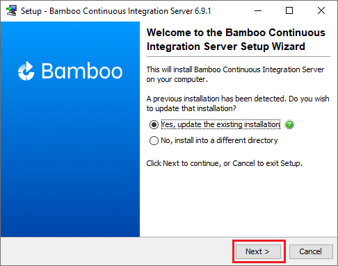
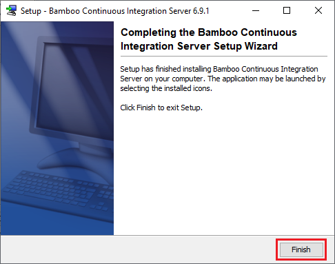
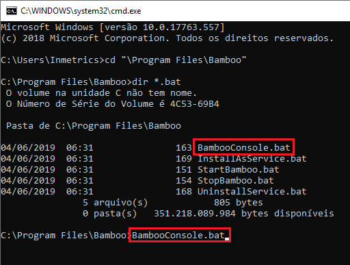
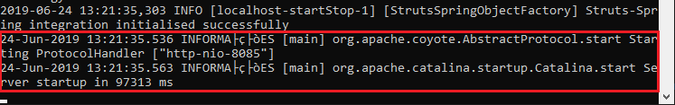
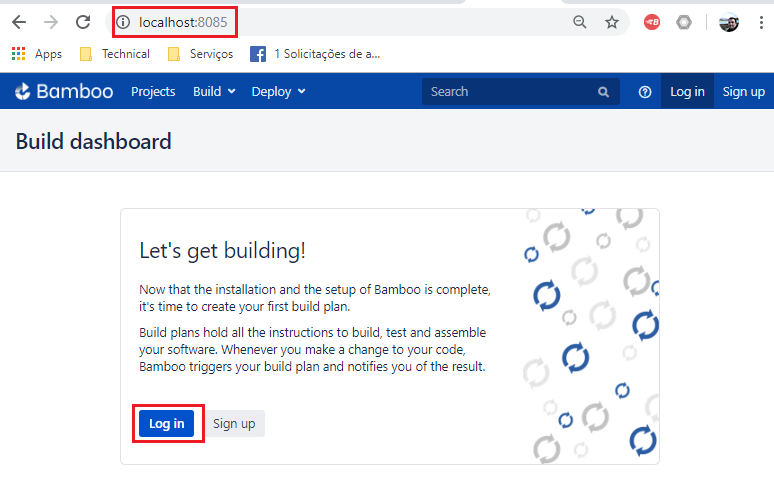
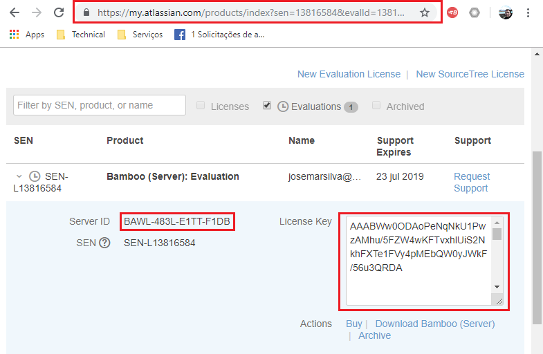

# README-GuiaInstalacao-Bambo-Windows.md

## 1. Introdução

O objetivo deste guia de configuração é **Instalar** o **Bamboo Server** em uma máquina **Windows**. 

### 2. Premissas

* Máquina Windows ou Linux
* Maven 3.6.x ou superior

### 3. Passo-a-passo

### 3.1. download do binário de instalação do Bamboo para Windows

[Download instalação Bamboo para Windows ](https://br.atlassian.com/software/bamboo/download)

### 3.2. Siga o passo a passo de instalação

* Passo 1: Execute o progama de instalação

* Passo 2: Siga o passo a passo do programa de instalação

### 3.3. Iniciar o Bamboo server

* Passo 1: Iniciar o Bamboo Server. Neste exemplo vou optar pelo modo ^console`. Localize o diretório de instalação do Bamboo server
  * Diretório de instalação: `C:\Program Files\Bamboo`
  * Execute o (.bat) script `BambooConsole.bat`

* Passo 2: Pelo browser, entre no endereço da máquina do Bamboo Server
  * url: `http://localhost:8085`

* Passo 3: Obtenha o `Server Id` e informe este campo na página de obtenção do **license key**

* Passo 4: Localize a página de __Evaluation Licence Key__ no site da Atlassian
  * `https://my.atlassian.com/product`

* Passo 5: Informe o **Licence Key** na instalação de seu produto

## Referências ##

* [Site Atlassian sobre Bamboo](https://br.atlassian.com/software/bamboo)
* [Bitbucket Pipeline Build and Deploy](https://bitbucket.org/product/features/pipelines)
* [Vídeo Youtub - Getting Started with Atlassian Bamboo - Continuous Delivery in Action](https://www.youtube.com/watch?v=rG-XxVYNS4c)
* [Bamboo vs Jenkins: Which CI/CD tool to use?](https://blog.valiantys.com/en/dev-tools-en/jenkins-vs-bamboo/)
* [Bamboo vs Jenkins](https://www.automation-consultants.com/bamboo-vs-jenkins/)
