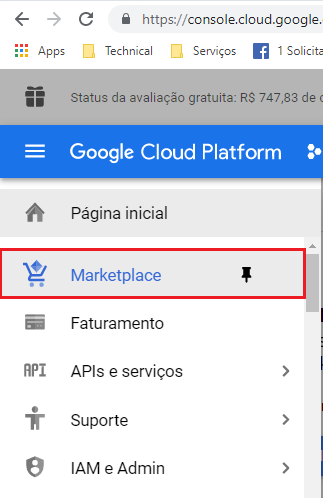
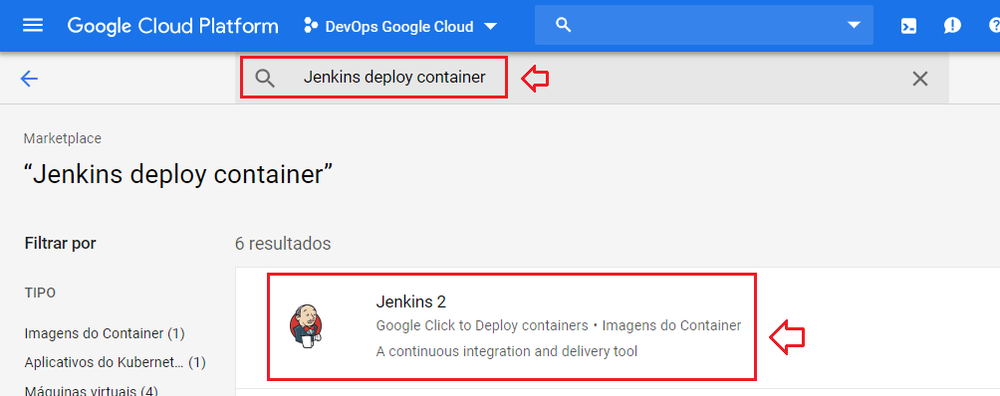
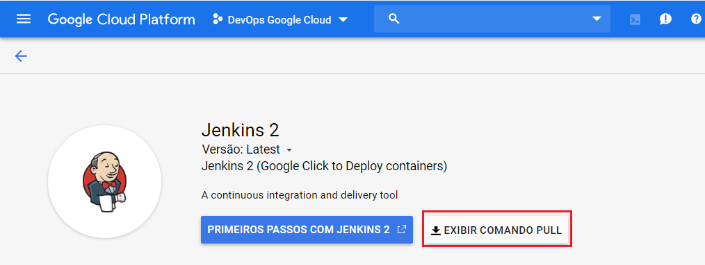
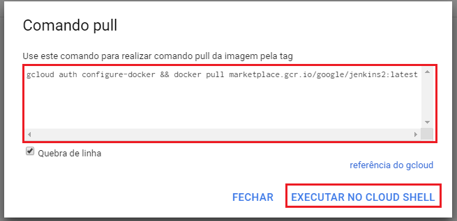
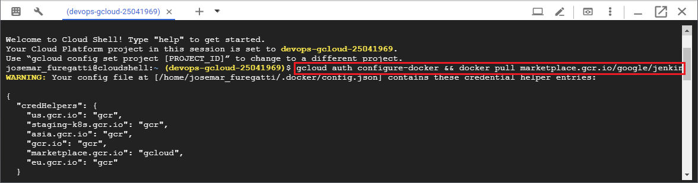

# README-GuiaInstalacao-GCloud-Docker-Jenkins.md


## 1. Introdução

O objetivo deste guia de configuração é **Criar** uma instância **Docker** do **Jenkins** no **GCloud** . 


### 2. Premissas

* [Google Cloud Plataform - GCloud][https://cloud.google.com/]


### 3. Passo-a-passo

### 3.1. Criação de uma instância Linux no GCloud

* Objetivo: Criar uma instância **Docker** da imagem **Jenkins 2** no Google Cloud Plataform.

* Passo 1: Entre na opção de menu `Market` no GCloud - Google Cloud Plataform



* Passo 2: Filtre a busca por "Jenkins Deploy Container" e em seguida clique no íncone `Jenkins 2` para prosseguir com a criação da instância do Jenkins



* Passo 3: Clique no botão `Exibir comando Pull` para obter o comando que dispara a instância do Jenkins



* Passo 4: Clique no botão `Executar no Cloud Shell`. Cole e execute o comando no `Cloud Shell`




```gcloud-shell
gcloud auth configure-docker && docker pull marketplace.gcr.io/google/jenkins2:latest
```

* Passo 5: Verifique a imagem baixada

```gcloud-shell
docker images
REPOSITORY                           TAG                 IMAGE ID            CREATED             SIZE
marketplace.gcr.io/google/jenkins2   latest              4f7b7094833d        6 days ago          478MB
```

* Passo 6: Clone o projeto do GitHub que tem a chamada do Jenkins

```gcloud-shell
$ git clone https://github.com/GoogleCloudPlatform/jenkins-docker.git
```

* Passo 7: Inicie o Docker com imagem do Jenkins 2.176 

```gcloud-shell
docker run \
  --name some-jenkins \
  -p 8080:8080 \
  -p 50000:50000 \
  -d \
  launcher.gcr.io/google/jenkins2
```


* Passo 8: 
	


## Referências ##

* [GCloud Quick Start](https://cloud.google.com/compute/docs/quickstart-linux)
* [Instância do GCloud](https://cloud.google.com/compute/docs/instances/?hl=pt-br)
* [Google Cloud Plataform - GCloud](https://cloud.google.com/)
* [Vídeo Deploy Container Google Cloud Engine](https://www.youtube.com/watch?v=wKiW1nufh1k)
* [Tutorial Jenkins Docker GCloud](https://github.com/GoogleCloudPlatform/jenkins-docker/blob/master/2/README.md)
