# README-GuiaInstalacao-GCloud-Linux-Bamboo.md


## 1. Introdução

O objetivo deste guia de configuração é **Instalar** uma instância Linux de Virtual Machine no **GCloud** . 


### 2. Premissas

* [Google Cloud Plataform - GCloud][https://cloud.google.com/]


### 3. Passo-a-passo

### 3.1. Criação de uma instância Linux no GCloud

* Objetivo: Criar uma máquina virtual Linux no Google Cloud Plataform.

* Passo 1: Na página inicial do **GCloud** escolha a opção de menu `Comutar` >> `Compute Engine` >> `Instância de VMs`

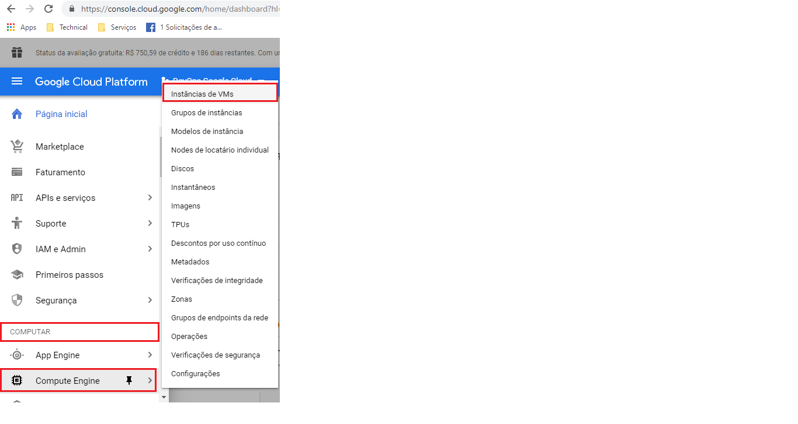

* Passo 2: No formulário `Instância de VM's`, clicar no botão `Criar`

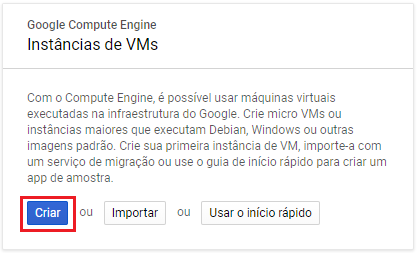

* Passo 3: No formulário `Criar uma instância`, escolha a opção `Marketplace`

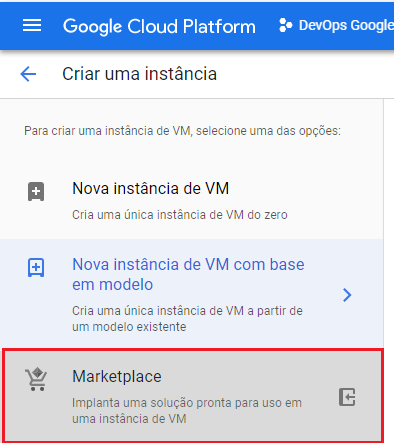

* Passo 4: No formulário `Criar uma instância`, escolher o item `Ubuntu Trusty`

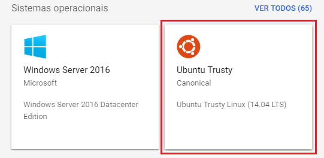

* Passo 5: Confirme os dados conforme abaixo e clique no botão `Criar` para confirmar a criação da VM e em seguida confirme os detalhes da criação

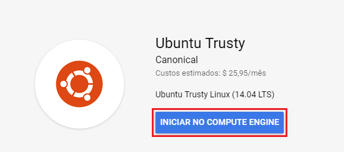
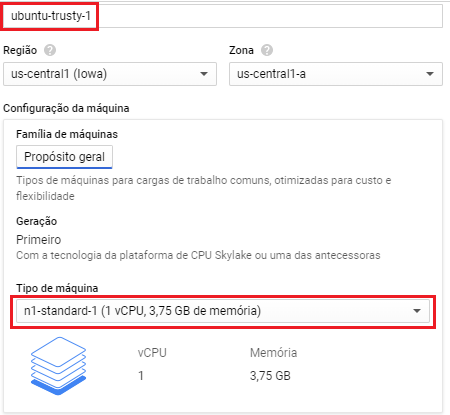
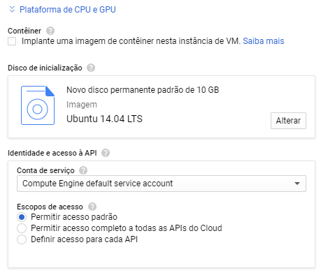
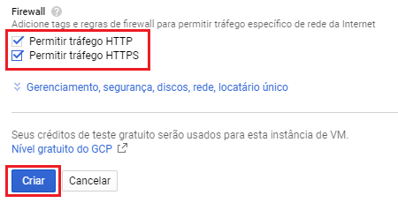

* Passo 6: Aguarde a criação de sua instância, conecte-se a sua nova instância com `gcloud` e `execute no cloud shell`

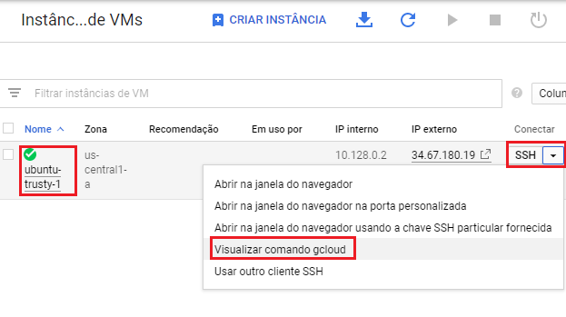

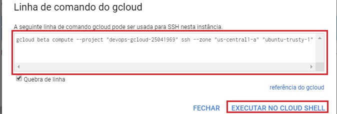

* Passo 7: Execute o comando de criação da instância no cloud shell, responda:
  * `Y` para confirmar a criação
  * `passphrase` no campo passphrase


* Passo 8: Atualize o sistema operacional 

```gcloud-shell
sudo apt update
```

### 3.2. Faça o download da versão Trial do Bamboo

* Passo 1: Link para download
[Download Bamboo](https://www.atlassian.com/software/bamboo/download)

* Passo 2: Faça upload de sua máquina local para a VM

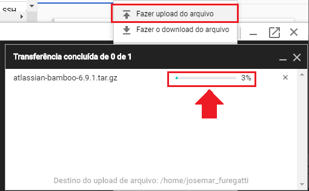


### 3.3. Descompacte o pacote

Passo 1: Descompactar o pacote baixado `atlassian-bamboo-6.9.1.tar` (seu número de versão pode variar)

```sh
mkdir /opt
cd /opt
tar -xvf ~/atlassian-bamboo-6.9.1.tar
```

Passo 2: Execute o Bamboo pela primeira vez

```sh
cd /opt/atlassian-bamboo-6.9.1/bin
sudo start-bamboo.sh
```

Passo 3: 


## Referências ##

* [GCloud Quick Start](https://cloud.google.com/compute/docs/quickstart-linux)
* [Instância do GCloud](https://cloud.google.com/compute/docs/instances/?hl=pt-br)
* [Create a Linux VM on Google Cloud Platform (GCP)](https://www.youtube.com/watch?v=2d5LzJNj46w)
* [Google Cloud Plataform - GCloud](https://cloud.google.com/)
* [Download Bamboo](https://www.atlassian.com/software/bamboo/download)
* [Vídeo Deploy Containeger Google Cloud Engine](https://www.youtube.com/watch?v=wKiW1nufh1k)
* [Tutorial create GCloud Kubernets](https://cloud.google.com/kubernetes-engine/docs/tutorials/hello-app)
