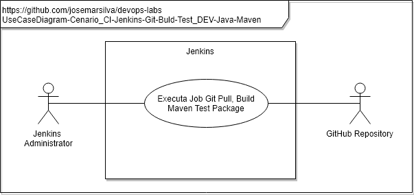
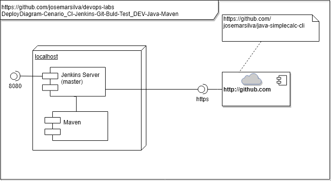
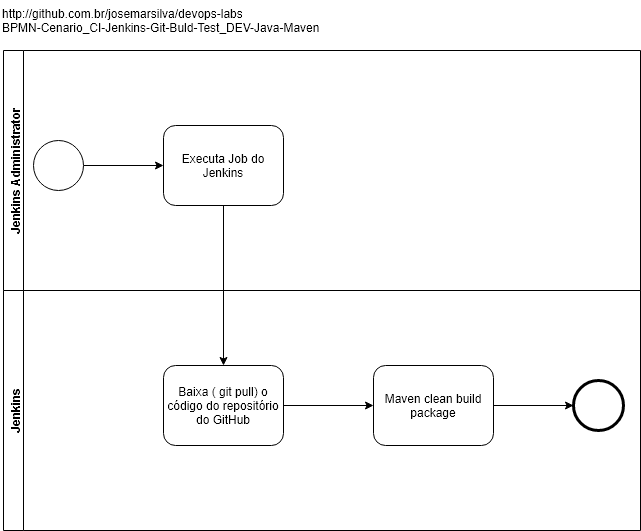

# README - devops-labs - Cenario_CI-Jenkins-Git-Build-Test_DEV-Java-Maven

## 1. Introdução

### 1.1. Objetivo
O objetivo deste cenário é demonstrar a ferramenta **Jenkins** integrando com o **Github** para buscar o código fonte de um aplicativo construído em linguagem **Java**, em seguida o **Jenkins** faz o **Build** com base no **Maven**, executa os testes unitários **Unit Test** já previstas na programação e gera o binário do aplicativo.

### 1.2. MindMap


### 1.3. Tópicos abordados
Este cenário de laboratório aborda os seguintes tópicos, conceitos, práticas e ferramentas:
* CI - Continuos Integration
* Jenkins
* Job do Jenkins executando `git pull`
* Job do Jenkins fazendo o build da aplicação com o Maven
* Automação do processo de Build e UnitTest
* Cultura do compromisso de ter o código fonte em um repositório (neste caso GitHub)

---
## 2. Cenário

### 2.1. Diagramas 

### a. Use Case Diagram

* Diagrama de Contexto do laboratório



* Diagrama de Contexto da aplicação `java-simplecalc-cli`
A aplicação [`java-simplecalc-cli` Calculadora Simples em linha de comando](https://github.com/josemarsilva/java-simplecalc-cli) recebe como parâmetro uma expressão, avalia e apresenta o seu resultado.


### b. Deploy Diagram



### c. BPMN



---
### 2.2. Pré requisitos

* [Jenkins instalado](https://github.com/josemarsilva/eval-jenkins)
  * [Jenkins instalado Windows](https://github.com/josemarsilva/eval-jenkins/blob/master/doc/README-GuiaConfiguracao-InstallJenkins.md)
* [Novo Job tipo FreeStyle Execute Shell Compila e Executa um programa Java com codigo fonte baixado do GitHub](https://github.com/josemarsilva/eval-jenkins/blob/master/doc/README-GuiaDemonstracao-JobFreestyleExecShellGitJavacJavaRun.md)
* Jenkins Master ou Slave configurado em máquina com Sistema Operacional Windows


---
### 2.3. Leitura pré-execução

* não há

---
### 2.4. Guia de Configuração

* Objetivo: Criar o Job no Jenkins do tipo `FreeStyle` para baixar o código fonte do projeto de um repositório do GitHub, Compilar o código fonte gerando os (.class) e executar o programa

* Passo 1: No menu  `Jenkins >> Novo job`
* Passo 2: No formulário de criação de um novo Job `/view/all/newJob`: 
  * Passo 1.a: preencha o campo `Enter an item name` com o nome do job `CI_Jenkins_Dev_Java`; 
  * Passo 1.b: escolha o tipo `Construir um projeto de software Freestyle`; c) clique no botão `OK`
* Passo 2: No formulário de configuração do Job `/job/<jobname>/configure`: 
  * Passo 2.a: Na sessão do formulário identificada por `Gerenciamento de código fonte` faça:
    * Passo 2.a.1: Clique no botão de rádio `git`
	* Passo 2.a.2: Preencha o campo `Repository URL` abaixo do grupo `Git`: ``
  * Passo 2.b: Na sessão do formulário identificada por `Build` faça:
    * Passo 2.b.1: Clique no botão `Adicionar passo no Build`
    * Passo 2.b.2: Escolha a opção `Executar no comando do Windows`
  * Passo 2.c: preencha o campo `Comando` abaixo do grupo `(Executar no comando do Windows)`: 

```script
echo O Jenkins vai construir o seu job abaixo do diretório de workspace
echo no caminho: [Jenkins-Home]\workspace\[nome-do-job]
echo - Nos vamos executar o comando "cd" para mostrar exatamente o local
echo   onde o Jenkins vai iniciar a execução do script 
cd .\src\java
javac Hello.java 
java -cp . Hello
```

  * Passo 2.d: clique no botão `salvar` para gravar o seu Job `CI_Jenkins_Dev_Java`
  * Passo 2.d: clique no botão `salvar` para gravar o seu Job `CI_Jenkins_Dev_Java`

---
### 2.5. Guia de Demonstração

* Objetivo: Executar o Job `CI_Jenkins_Dev_Java` configurado na etapa anterior, observar e analisar os resultados

* Passo 1: Na página principal do Jenkins, na lista de jobs cadastrados, localize e clique sobre o link do job `CI_Jenkins_Dev_Java` configurado na etapa anterior
* Passo 2: No formulário de detalhamento do job `/job/[jobname]`, clique no item do menu lateral esquerdo  `Construir agora`
* Passo 3: Observe que na lateral esquerda, abaixo do menu, o Jenkins apresenta o `Histórico de builds`, isto é o histórico da construção dos builds. O primeiro de cima para baixo e maior número sequencial, deve ser a execução do seu job. Clique no link da construção do seu `build`
* Passo 4: Observe que o formulário de detalhamento do build de um job `/job/[nome-do-job/[numero-da-build]/` apresentará detalhes da execução. Você tem acesso a detalhes como: status de execução, data e hora completa da execução, tempo de execução, etc


* Passo 5: Clique no link  `Saída do console` para observar os detalhes da execução do job


---
## 3. Conclusão

* Observe que neste cenário o Jenkins fez as atividades de "Source Code Management", "Build", "Deploy" e "Execute" todas juntas, de forma monolítico. Não é a melhor forma de construir
* Já podemos ver por este simples exemplo a importância de manter os códigos fontes em uma ferramenta __Source Code Management__ e os benefícios que a integração deste repositório traz ao processo de __CI - Continuos Integration__
* Observe que neste cenário estamos baixando o código fonte de um repositório público, sem controle de acesso rígido


---
## I - Referências

* [Java SimpleCalc Cli - Calculadora Simples em linha de comando](https://github.com/josemarsilva/java-simplecalc-cli)
