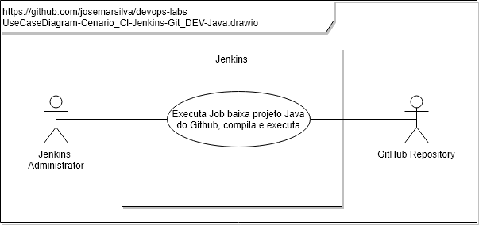
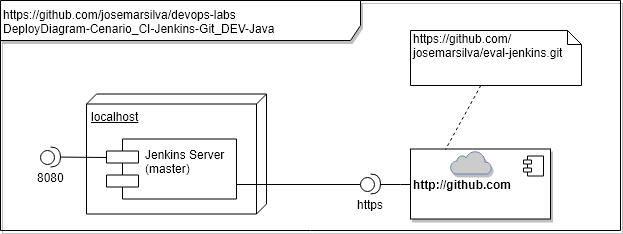

# README - devops-labs - Cenario_CI-Jenkins-Git_DEV-Java

## 1. Introdução

### 1.1. Objetivo
O objetivo deste cenário é demonstrar a ferramenta **Jenkins** integrando com o **Github** para buscar o código fonte de um aplicativo construído em linguagem **Java**, em seguida compila o aplicativo gerando um código executável e finalmente aplicativo.

### 1.2. MindMap

---
## 2. Cenário

### 2.1. Diagramas 

### a. Use Case Diagram

### b. Deploy Diagram

### c. Activity Diagram
n/a

---
### 2.2. Pré requisitos

* [Jenkins instalado](https://github.com/josemarsilva/eval-jenkins)
  * [Jenkins instalado Windows](https://github.com/josemarsilva/eval-jenkins/blob/master/doc/README-GuiaConfiguracao-InstallJenkins.md)
* [Novo Job tipo FreeStyle Execute Shell Compila e Executa um programa Java com codigo fonte baixado do GitHub](https://github.com/josemarsilva/eval-jenkins/blob/master/doc/README-GuiaDemonstracao-JobFreestyleExecShellGitJavacJavaRun.md)

## 3. Conclusão

---
## I - Referências

* [Jenkins instalado](https://github.com/josemarsilva/eval-jenkins)
