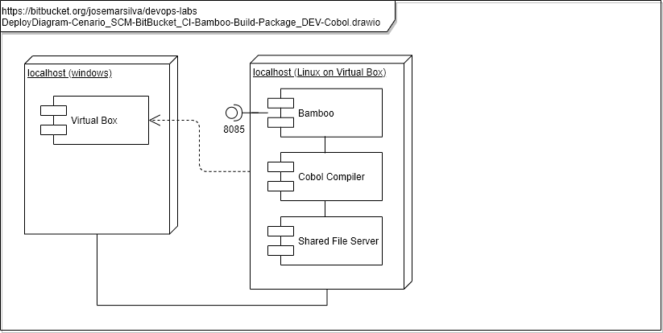

# README - devops-labs - Cenario_SCM-Git_CI-Bamboo-Build-Package_DEV-Cobol.md

## 1. Introdução

### 1.1. Objetivo
O objetivo deste cenário é demonstrar a ferramenta de **CI**: **Bamboo** integrando com a ferramenta de **SCM**: **Github** para buscar o código fonte de um aplicativo construído em linguagem de programação **Cobol** . Em seguida o **CI** / **Bamboo** faz o **CI** / **Build** com base no **Compilador Cobol Free**, gera o **CI** / **Package** do programa objeto executável e executa um pacote de scripts de testes.

### 1.2. MindMap

### 1.3. Tópicos abordados
Este cenário de laboratório aborda os seguintes tópicos, conceitos, práticas e ferramentas:

* Requirement Management - Requisito de negócio foi identificado e especificado
* SCM - Source Code - BitBucket.org
* Programming Language - Cobol
* CI - Continuos Integration ( Checkout Source Code, Compile, Build, Package )
* Stack Tools Used: Cobol Free/Linux, GitHub.com, Bamboo

---
## 2. Cenário

### 2.1. Diagramas 

### a. Use Case Diagram

* Diagrama de Contexto do laboratório

### b. Deploy Diagram

### c. BPMN

---
### 2.2. Pré requisitos

* [Container Docker com Bamboo instalado](https://github.com/josemarsilva/eval-virtualbox-vm-ubuntu-server/#414-docker---bamboo-server)
* [Ativação da licensa de uso do Bamboo](https://github.com/josemarsilva/eval-virtualbox-vm-ubuntu-server/blob/master/doc/README_InstallBambooLicense_StepByStep.md)
* [Guia de Instalação Bamboo Server para Windows](README-GuiaInstalacao-Bambo-Windows.md)
* [Cobol Free for Linux Instalado](https://github.com/josemarsilva/eval-virtualbox-vm-ubuntu-server#321-compilador-cobol-free-linux)

---
### 2.3. Leitura pré-execução

* não há

---
### 2.4. Guia de Configuração

* __em construção__

---
### 2.5. Guia de Demonstração

* Passo 01: `BPMN - Identificar requisitos de negócio #01-01-01`: 
  * O time de analistas de negócio identificou a demanda: __precisamos dizer "Olá mundo" aos clientes__
* Passo 02: `BPMN - Especificar requisitos funcionais #01-01-02`: 
  * O time de analistas de sistemas especificou os requisitos do sistemas que deve ser construído:
    * Construir um programa que ao ser executado informe a mensagem "Olá mundo"
* Passo 03: `BPMN - Especificar requisitos não funcionais #01-01-03`:
    * O sistema deve ser construído na linguagem de programação **Cobol**
    * O sistema deve ser construído para ser entregue pela esteira DevOps do laboratório
    * A esteira DevOps deve implementar:
	  * **SCM**: Controle de versões pelo **GitHub**
	  * **CI**: Integração **contínua** entre versão de fontes, **compilação** e **empacotamento**
* Passo 04: `BPMN - Especificar casos de testes #01-01-04`: 
  * O time de analistas de testes especificou os Casos de Testes que devem ser construído:
    * Construir o caso de teste unitário: quando o programa for iniciado, verificar se a mensagem "Olá mundo" foi apresentada
* Passo 05: `BPMN - Elaborar e Revisar planejamento #01-01-05`:
  * Em conjunto, os times de analistas de negócios, analistas de sistemas e analistas de testes elaboraram e revisaram o planejamento do desenvolvimento do sistema
    * Cronograma construído: 2h para desenvolvimento

---
## 3. Conclusão
* Observe que neste cenário o Bamboo fez as atividades de "SCM - Source Code Management", "BUILD - Compilar", de forma automática

---