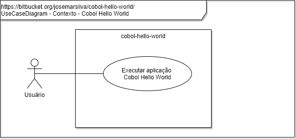
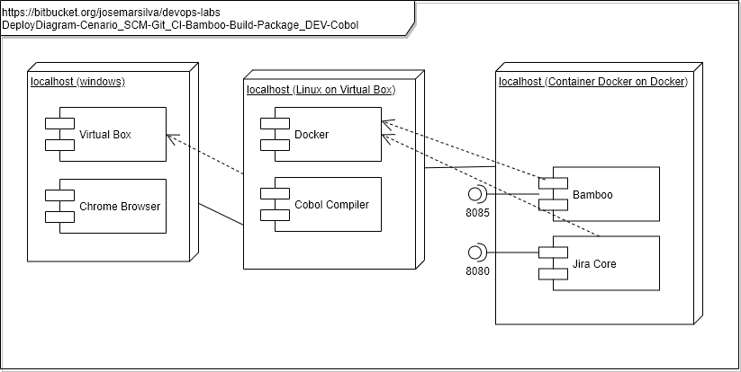

# README - devops-labs - Cenario_SCM-Git_CI-Bamboo-Build-Package_DEV-Cobol.md

## 1. Introdução

### 1.1. Objetivo
O objetivo deste cenário é demonstrar a ferramenta de **CI**: **Bamboo** integrando com a ferramenta de **SCM**: **Github** para buscar o código fonte de um aplicativo construído em linguagem de programação **Cobol** . Em seguida o **CI** / **Bamboo** faz o **CI** / **Build** com base no **Compilador Cobol Free**, gera o **CI** / **Package** do programa objeto executável e executa um pacote de scripts de testes.

### 1.2. MindMap

### 1.3. Tópicos abordados
Este cenário de laboratório aborda os seguintes tópicos, conceitos, práticas e ferramentas:

* Requirement Management - Requisito de negócio foi identificado e especificado
* SCM - Source Code GitHub.com
* Programming Language - Cobol
* CI - Continuos Integration ( Checkout Source Code, Compile, Build, Package )
* Stack Tools Used: Cobol Free/Linux, GitHub.com, Bamboo

---
## 2. Cenário

### 2.1. Diagramas 

### a. Use Case Diagram

* Diagrama de Contexto do laboratório

### b. Deploy Diagram

### c. BPMN

---
### 2.2. Pré requisitos

* [Bamboo instalado](https://github.com/josemarsilva/eval-virtualbox-vm-ubuntu-server/doc/README_InstallBambooLicense_StepByStep.md)
* [Guia de Instalação Bamboo Server para Windows](README-GuiaInstalacao-Bambo-Windows.md)
* [Cobol Free for Linux Instalado](https://github.com/josemarsilva/eval-virtualbox-vm-ubuntu-server#321-compilador-cobol-free-linux)

---
### 2.3. Leitura pré-execução

* não há

---
### 2.4. Guia de Configuração

O objetivo é você criar um **projeto** (__project__), **plano** (__plan__) e **construção** (__build__) para realizar o download do código do GitHub e fazer o `Build` e o `Package`.

* Passo 1: Efetue o login no Bamboo Server

---
### 2.5. Guia de Demonstração

* under-construction

---
## 3. Conclusão
* Observe que neste cenário o Bamboo fez as atividades de "SCM - Source Code Management", "BUILD - Compilar", de forma automática

---