# README - devops-labs - Cenario_CI-Bamboo-Git-Build-Test-Package_DEV-Java-SpringBoot-Maven

## 1. Introdução

### 1.1. Objetivo
O objetivo deste cenário é demonstrar a ferramenta **Bamboo** integrando com o **Github** para buscar o código fonte de um aplicativo construído em linguagem **Java** e framework **Spring-Boot**. Em seguida o **Bamboo** faz o **Build** com base no **Maven**, executa os testes unitários **Unit Test** já previstas na programação e gera o pacote de aplicativo.

### 1.2. MindMap

### 1.3. Tópicos abordados
Este cenário de laboratório aborda os seguintes tópicos, conceitos, práticas e ferramentas:
* CI - Continuos Integration
* Bamboo
* Bamboo Project, Plan e Build executando `git pull`
* Bamboo Project, Plan e Build executando  fazendo o `Build` da aplicação com o `Maven`
* Automação do processo de `Build`, `UnitTest` e `Package`
* Cultura do compromisso de ter o código fonte em um repositório (GitHub)

---
## 2. Cenário

### 2.1. Diagramas 

### a. Use Case Diagram

* Diagrama de Contexto do laboratório

* Diagrama de Contexto da aplicação `java-simplecalc-spring-boot`
A aplicação [`java-simplecalc-spring-boot` Calculadora Simples de expressão pela web](https://github.com/josemarsilva/java-simplecalc-spring-boot) recebe como parâmetro uma expressão, avalia e apresenta o seu resultado.

### b. Deploy Diagram

### c. BPMN
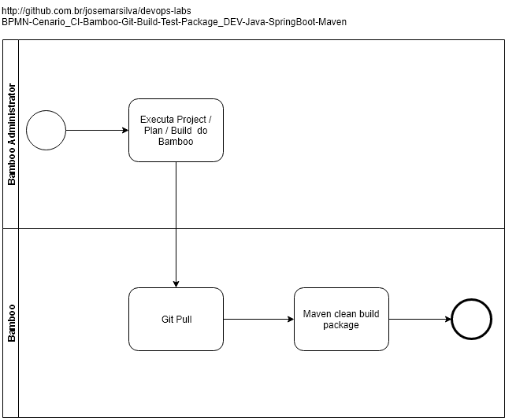

---
### 2.2. Pré requisitos

* [Bamboo instalado](https://github.com/josemarsilva/eval-jenkins)
* [Guia de Instalação Bamboo Server para Windows](README-GuiaInstalacao-Bambo-Windows.md)
* Maven 3.6.x instaldo

---
### 2.3. Leitura pré-execução

* não há

---
### 2.4. Guia de Configuração
O objetivo é você criar um **projeto** (__project__), **plano** (__plan__) e **construção** (__build__) para realizar o download do código do GitHub e fazer o `Build` e o `Package`.

* Passo 1: Efetue o login no Bamboo Server

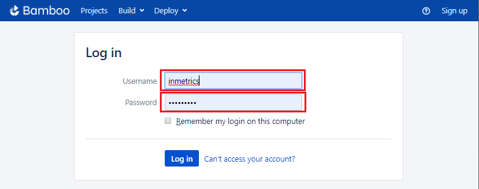

* Passo 2: Clique no botão de criar **projeto/plano** `create project`

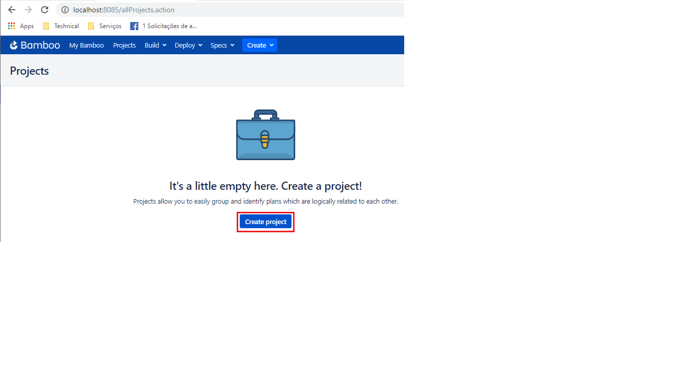

* Passo 3: Informe os campos do novo **projeto** a ser criado: `Project Name`, `Project Key`, `Project Description`, `Project Access` e em seguida clique no botão `Save`

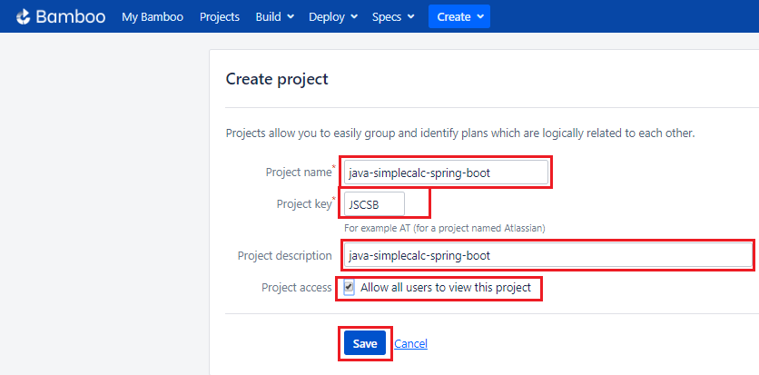

* Passo 4: Informe os campos do novo **plano** a ser criado: `Plan Name`, `Plan Key`, `Plan Description`, `Plan Access` e em seguida clique no botão `Save`

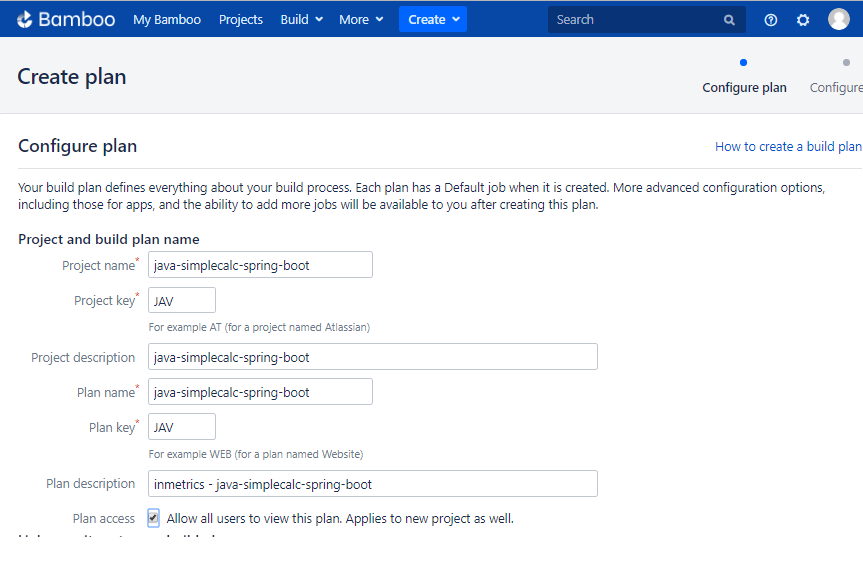

* Passo 5: Informe os campos de configuração do GitHub repository na sessão `Build repository to new build plan`

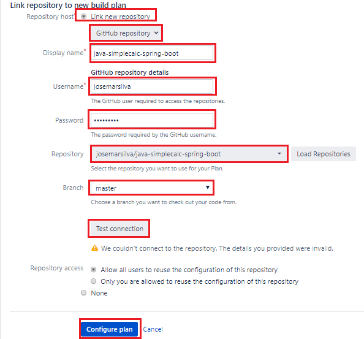

* Passo 6: Clique no botão `add task` para adicionar uma nova tarefa ao seu plano que fará o `Maven Build` do projeto/plano

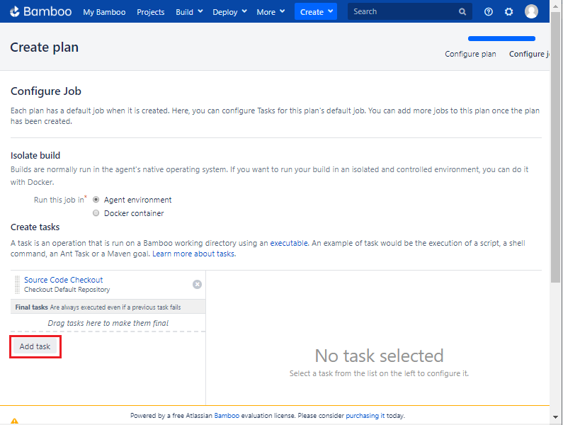

* Passo 7: Escolha o ícone do `Maven 3.x`

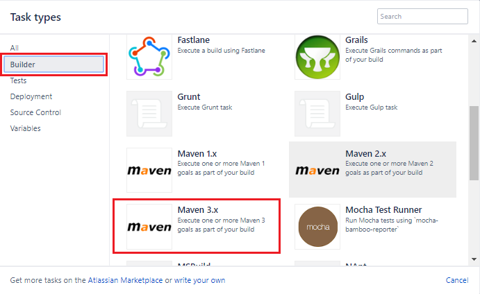

* Passo 8: Configure os parâmetros de execução do `Maven`

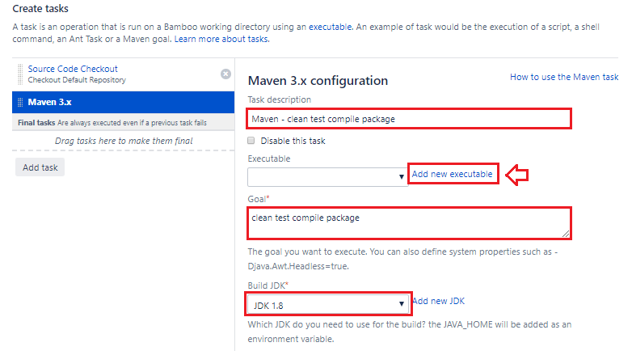

* Passo 9: Configure o local de execução do programa `Maven` em sua máquina

* Passo 10: Configure os parâmetros de onde ficarão os arquivos no workspace

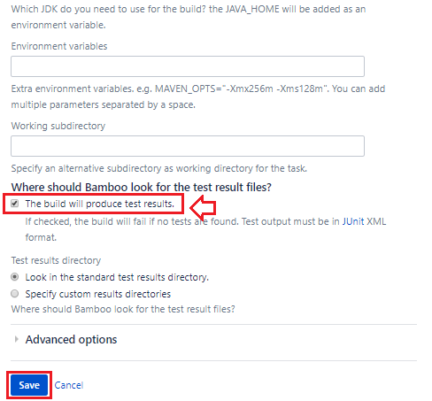

* Passo 11: Clique no botao `Save` para salvar a configuração do plano e continuar

* Passo 12: Observe que o Plano foi criado com o status de desabilitado

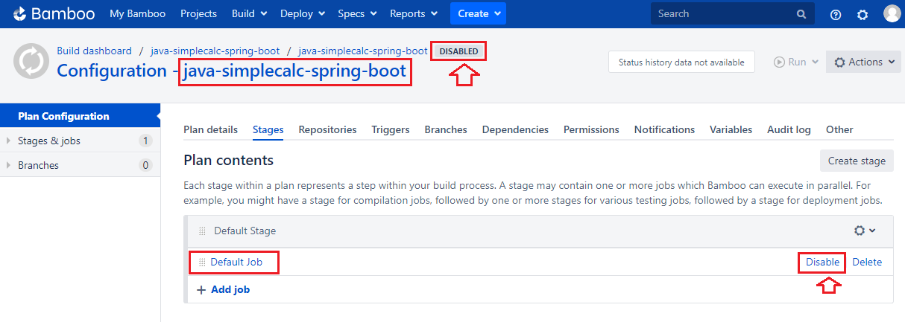

---
### 2.5. Guia de Demonstração

* Passo 1: 

---
## 3. Conclusão
* Observe que neste cenário o Bamboo fez as atividades de "Source Code Management", "Build", "Unit Test", de forma automática
* Observe que configuramos o __goals__ `clean compile pacakge` no Maven e ele gerou o ".jar" da aplicação, porém ainda não fizemos o "Deploy" desta aplicação 

---
## I - Referências

* [`java-simplecalc-spring-boot` Calculadora Simples de expressão pela web](https://github.com/josemarsilva/java-simplecalc-spring-boot)
* [Site Atlassian sobre Bamboo](https://br.atlassian.com/software/bamboo)
* [Bitbucket Pipeline Build and Deploy](https://bitbucket.org/product/features/pipelines)
* [Vídeo Youtub - Getting Started with Atlassian Bamboo - Continuous Delivery in Action](https://www.youtube.com/watch?v=rG-XxVYNS4c)
* [Bamboo vs Jenkins: Which CI/CD tool to use?](https://blog.valiantys.com/en/dev-tools-en/jenkins-vs-bamboo/)
* [Bamboo vs Jenkins](https://www.automation-consultants.com/bamboo-vs-jenkins/)
