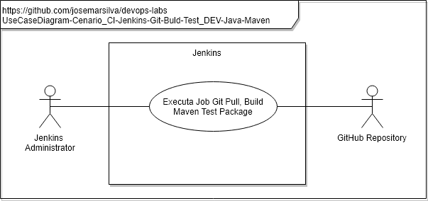
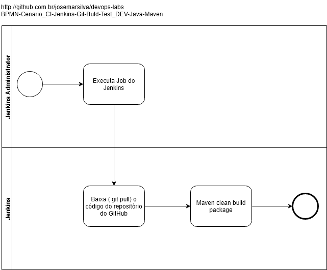

# README - devops-labs - Cenario_CI-Jenkins-Git-Build-Test_DEV-Java-Maven

## 1. Introdução

### 1.1. Objetivo
O objetivo deste cenário é demonstrar a ferramenta **Jenkins** integrando com o **Github** para buscar o código fonte de um aplicativo construído em linguagem **Java**, em seguida o **Jenkins** faz o **Build** com base no **Maven**, executa os testes unitários **Unit Test** já previstas na programação e gera o binário do aplicativo.

### 1.2. MindMap

### 1.3. Tópicos abordados
Este cenário de laboratório aborda os seguintes tópicos, conceitos, práticas e ferramentas:
* CI - Continuos Integration
* Jenkins
* Job do Jenkins executando `git pull`
* Job do Jenkins fazendo o build da aplicação com o Maven
* Automação do processo de Build e UnitTest
* Cultura do compromisso de ter o código fonte em um repositório (neste caso GitHub)

---
## 2. Cenário

### 2.1. Diagramas 

### a. Use Case Diagram

* Diagrama de Contexto do laboratório

* Diagrama de Contexto da aplicação `java-simplecalc-cli`
Esta aplicação implementa uma [Calculadora Simples em linha de comando](https://github.com/josemarsilva/java-simplecalc-cli) recebe como parâmetro uma expressão, avalia e apresenta o seu resultado.

### b. Deploy Diagram

### c. BPMN

---
### 2.2. Pré requisitos

* [Jenkins instalado](https://github.com/josemarsilva/eval-jenkins)
* [Jenkins instalado GCloud em Docker](https://github.com/josemarsilva/googlecloudplatform#gcloud-engine---jenkins-using-docker)
* [Instalação do Plugin Maven Integration](https://github.com/josemarsilva/eval-jenkins/blob/master/doc/README-GuiaConfiguracao-MavenJenkins.md)

---
### 2.3. Leitura pré-execução

* não há

---
### 2.4. Guia de Configuração

* Passo 1: Crie um novo Job chamado com o nome `CI-Jenkins-Git-Build-Test_DEV-Java-Maven` do tipo ``Construir um projeto Maven`

* Passo 2: Na configuração do Job informe o endereço do repositório `https://github.com/josemarsilva/java-simplecalc-cli.git` do projeto [`java-simplecalc-cli` Calculadora Simples em linha de comando](https://github.com/josemarsilva/java-simplecalc-cli) :

* Passo 3: Na configuração do Job, na sessão `Construir` informe os __goals__ (metas e opções) do Maven para o projeto: `clean compile test package`

* Passo 4: Clique no botão `Salvar` para salvar as configurações do Job criada

---
### 2.5. Guia de Demonstração

* Passo 1: Clique no item do menu lateral esquerdo  `Construir agora`

* Passo 2: Clique no link  `Saída do console` para observar os detalhes da execução do job

---
## 3. Conclusão
* Observe que neste cenário o Jenkins fez as atividades de "Source Code Management", "Build", "Unit Test", de forma automática
* Observe que configuramos o __goals__ `package` no Maven e ele gerou o ".jar" da aplicação, porém ainda não fizemos o "Deploy" desta aplicação 

---
## I - Referências

* [Java SimpleCalc Cli - Calculadora Simples em linha de comando](https://github.com/josemarsilva/java-simplecalc-cli)
* [Configurando Jenkins e Maven](https://www.tutorialspoint.com/jenkins/jenkins_maven_setup.htm)
