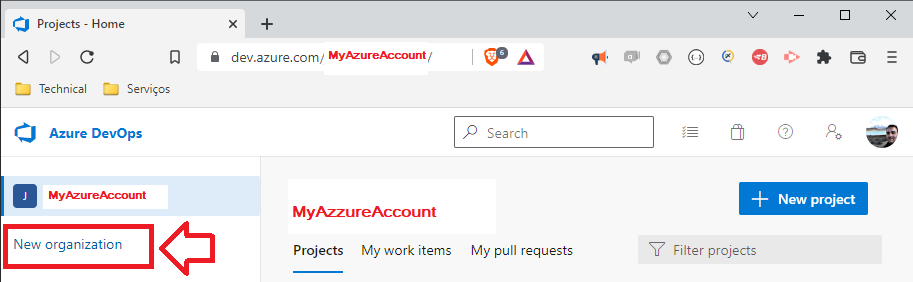
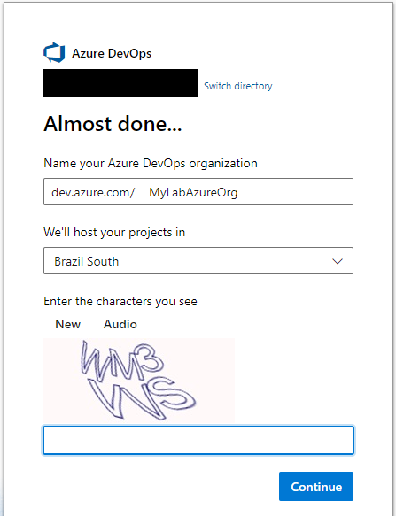
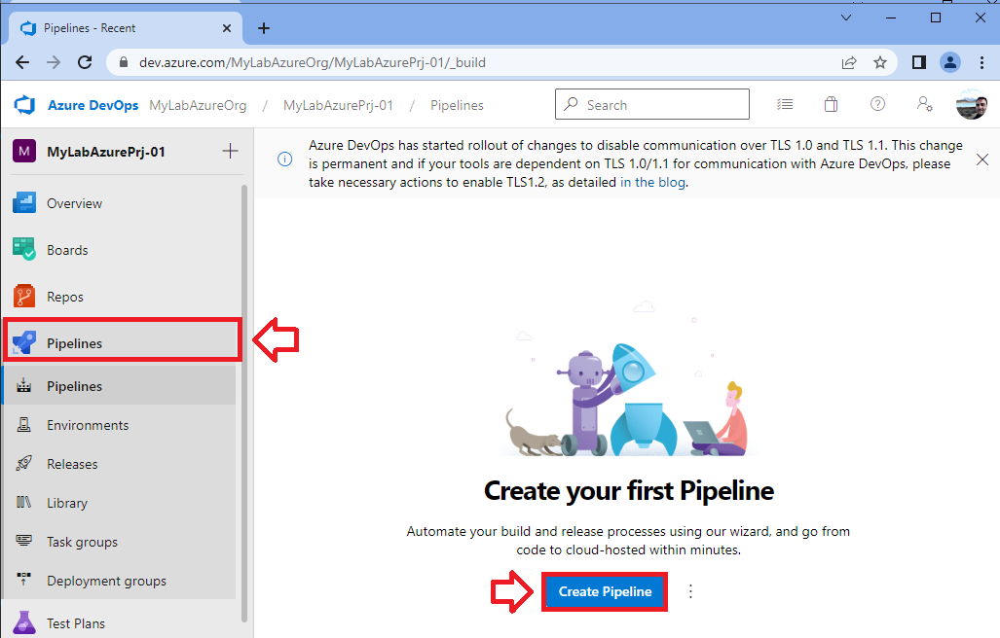
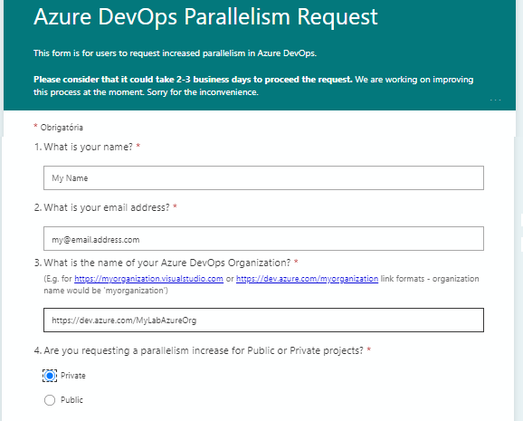
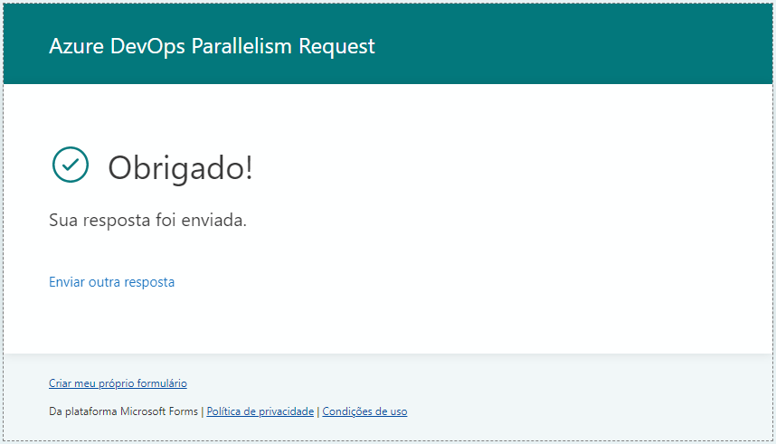
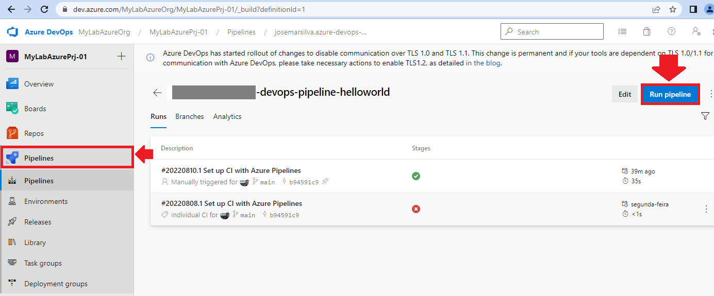
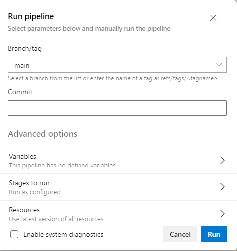
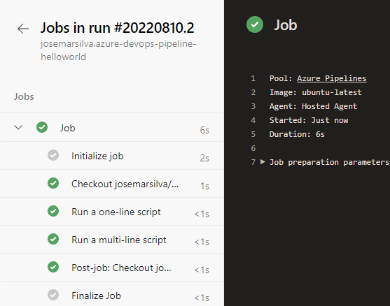

`./md/README_Cenario_Pipeline-AzureDevOps-HelloWorld.md` - Pipeline Azure DevOps HelloWorld

## 1. Introdução

Este repositório contém os artefatos do projeto / laboratório **LAB-XX: Pipeline de Java on Azure DevOps** abaixo do projeto [devp´s=çabs](../README.md). Este laboratório consiste em:
* Configurar o DevOps Azure para o Pipeline
* Explorar os recursos e funcionalidades básicas do produto

##### Table of Contents  
- [1. Introdução](#1-introdução)
- [2. Documentação](#2-documentação)
- [3. Projeto / Laboratório](#3-projeto--laboratório)
  * [3.1. Pré-Requisitos, Pré-Condições e Premissas](#31-pré-requisitos-pré-condições-e-premissas)
    + [3.1.1. Tecnologias e ferramentas](#311-tecnologias-e-ferramentas)
    + [3.1.2. Ferramental de apoio](#312-ferramental-de-apoio)
  * [3.5. Guia de Estudo](#35-guia-de-estudo)
- [I - Referências](#i---referências)

## 2. Documentação

* n/a

## 3. Projeto / Laboratório

### 3.1. Pré-Requisitos, Pré-Condições e Premissas

#### 3.1.1. Tecnologias e ferramentas

* Programming Languages / Libraries / IDE:
	* Java JDK 1.8 / Eclipse (version Neon recommended) / Apache Maven 3.6 (recommended > 3.3)
* Azure DevOps: Pipeline

#### 3.1.2. Ferramental de apoio

* Ferramenta: [Draw.IO](https://app.diagrams.net/) (only for diagrams design and documentation)
* Ferramenta: [FreeMind for Windows](https://freemind.br.uptodown.com/windows)

### 3.5. Guia de Estudo

### 3.5.1. Documentação oficial e tutoriais de referência

* n/a

### 3.5.2. Pré-Requisitos

* Conta `<MyAzureAccount>` no serviço da [Azure DevOps](https://dev.azure.com/)

### 3.5.3. Criar uma nova `Organization` no Azure DevOps

* Em `https://dev.azure.com/<MyAzureAccount>/` clique no menu lateral esquerdo `New Organization`

* Em dialogbox `Azure DevOps - Get started with Azure DevOps` clique botão `Continue`
* Em dialogbox `Azure DevOps - Almost done ...` preencha os campos:
  * Name your Organization: `MyLabAzureOrg` (substituir por outro nome único se conflitar)
  * We will host your project in: `Brazil`
  * Fill capcha and clique `Continue`

### 3.5.4. Criar um novo `Project` no Azure DevOps

* Em `https://dev.azure.com/MyLabAzureOrg/` clique no link no menu lateral esquerdo `New Project`

* Em formulário `Create a project to get started` preencha os campos:
  * Project Name: `MyLabAzurePrj-01`
  * Description: `My Laboratory Azure Project - 01`
  * Visibility: `Private`
  * Advanced
    * Version Control: `Git`
    * Work item Process: `Basic`

### 3.5.5. Criar um novo `Pipeline` no Azure DevOps

* Em `https://dev.azure.com/MyLabAzureOrg/MyLabAzurePrj-01/` clique no link no menu lateral esquerdo `Pipelines` em seguida no clique no botão `Create Pipeline`

* Em formulário `New Pipeline` na aba `Connect` preencha os campos:
  * Where is your code: `GitHub (yaml)`
    * _Login into GitHub using credentials username and password if necessary_
  * Select repository: `https://github.com/josemarsilva/azure-devops-pipeline-helloworld`
    * _Repository may be empty_
    * _Approve and install Azure DevOps Pipelines - Configure Repository access_: `Only select repository`
    * _Login into Azure DevOps using credentials username and password if necessary_
  * Configure your pipeline
    * **Se***** você escolheu um repositorio vazio **Então** escolha `Starter Pipeline` **Senão** escolha `Existing Azure Pipeline YAML file`
  * Review your pipeline YAML
    * Observe que será sugerido um arquivo de configuração YAML default básico de `# Starter pipeline, Start with a minimal pipeline that you can customize to build and deploy your code. Add steps that build, run tests, deploy, and more: https://aka.ms/yaml`
    * Observe que o código sugerido contempla uma imagem `pool: vmImage: ubuntu-latest`
    * Clique no botão `Save and Run`
  * Save changes to pipeline and Run
    * Em dialogbox `Save and run` preencha os campos:
      * Commit message: `Set up CI with Azure Pipelines` com a mensagem da mudança no pipeline
      * Clique no botão  `Save and Run`

* Troubleshooting: 
  * **Se** durante a execução obtiver o erro `##[error]No hosted parallelism has been purchased or granted. To request a free parallelism grant, please fill out the following form https://aka.ms/azpipelines-parallelism-request` 
  * **Então** você pode estar usando uma conta de avaliação gratuita e precisa solicitar a permissão de paralelismo. https://stackoverflow.com/questions/68405027/how-to-resolve-no-hosted-parallelism-has-been-purchased-or-granted-in-free-tie
    * Clique no link a seguir para fazer a solicitação de paralelismo em conta gratuita. Preencha o seu nome, seu e-mail associado a conta Azure DevOps e a URL da sua Organização

### 3.5.6. Executar o novo `Pipeline` no Azure DevOps

* Em `https://dev.azure.com/MyLabAzureOrg/MyLabAzurePrj-01/` clique no link no menu lateral esquerdo `Pipelines`
  * em seguida no link do novo pipeline criado `<MyAzureAccount>.azure-devops-pipeline-helloworld`
  * em seguida clique no link `Run Pipeline` no topo superior direito

* Na dialogbox `Run Pipeline` na aba `Connect` preencha os campos:
  * Commit: com uma mensagem de texto para ser gravada junto com a execução
  * Clique no botão `Run Pipeline`
* Clique sobre o link `Jobs` para ver os detalhes da execução

## I - Referências

* Github README.md writing sintax
  * [Basic Github Markdown Writing Format](https://docs.github.com/pt/free-pro-team@latest/github/writing-on-github/basic-writing-and-formatting-syntax)  
  * [Github Markdown Chead Sheet](https://guides.github.com/pdfs/markdown-cheatsheet-online.pdf)
  * [Github Mastering Markdown](https://guides.github.com/features/mastering-markdown/#what)
  * [Table of contents generated with markdown-toc](http://ecotrust-canada.github.io/markdown-toc/)

