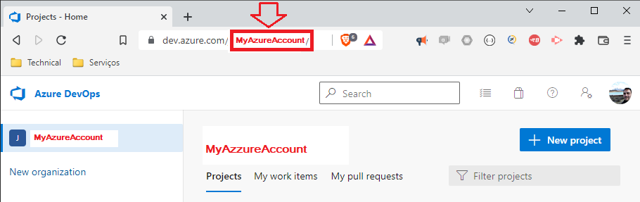
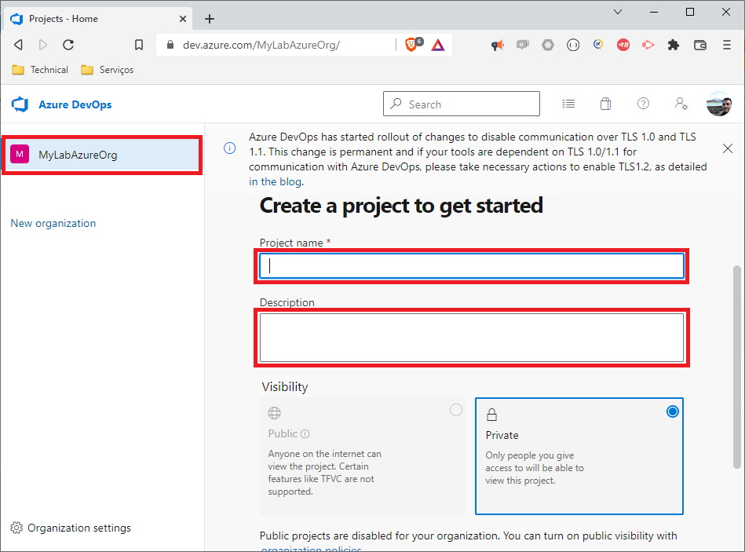

`./md/README_Cenario_Pipeline-AzureDevOps-SelfHostedAgent-CD-sqlserver-migrations.md` - Pipeline Azure DevOps SelfHostedAgent - SQLServer Migrations

## 1. Introdução

Este repositório contém os artefatos do projeto / laboratório **LAB-13: Pipeline Azure DevOps on a Self Hosted Agent running SQLServer Migrations** abaixo do projeto [devp´s=çabs](../README.md). Este laboratório consiste em:
* Configurar um Pipeline da tarefa remota executada pelo Self Hosted Agent - SQLServer Migrations 
* Explorar os recursos e funcionalidades básicas do produto

##### Table of Contents  
- [1. Introdução](#1-introdução)
- [2. Documentação](#2-documentação)
- [3. Projeto / Laboratório](#3-projeto--laboratório)
  * [3.1. Pré-Requisitos, Pré-Condições e Premissas](#31-pré-requisitos-pré-condições-e-premissas)
    + [3.1.1. Tecnologias e ferramentas](#311-tecnologias-e-ferramentas)
    + [3.1.2. Ferramental de apoio](#312-ferramental-de-apoio)
  * [3.5. Guia de Estudo](#35-guia-de-estudo)
- [I - Referências](#i---referências)


## 2. Documentação

### 2.2. Diagrama de Implantação (Deploy Diagram)

 

### 2.3. Diagrama de BPMN (Business Process Modeling Notation)

 


## 3. Projeto / Laboratório

### 3.1. Pré-Requisitos, Pré-Condições e Premissas

#### 3.1.1. Tecnologias e ferramentas

* Azure DevOps Account, Azure DevOps Organization, Azure DevOps Project
* Azure DevOps: Pipeline, Self Hosted Agent

#### 3.1.2. Ferramental de apoio

* Ferramenta: [Draw.IO](https://app.diagrams.net/) (only for diagrams design and documentation)
* Ferramenta: [FreeMind for Windows](https://freemind.br.uptodown.com/windows)


### 3.5. Guia de Estudo

### 3.5.1. Documentação oficial e tutoriais de referência

* https://www.youtube.com/watch?v=xuKXO811O_w
* https://www.youtube.com/watch?v=8Vkxbx-zM5w
* [11 - Cenario Pipeline AzureDevOps HelloWorld](README_Cenario_Pipeline-AzureDevOps-HelloWorld.md)

### 3.5.2. Pré-Requisitos

* Laboratório [11 - Cenario Pipeline AzureDevOps HelloWorld](README_Cenario_Pipeline-AzureDevOps-HelloWorld.md) que ensina criar conta, organização e projeto
* Laboratório [12 Cenario Pipeline AzureDevOps Self Hosted Agent](README_Cenario_Pipeline-AzureDevOps-SelfHostedAgent.md) que ensina criar e configurar o agent pool
* Ferramenta [sqlserver-migrations](https://github.com/josemarsilva/sqlserver-migrations)


* Conta `<MyAzureAccount>` no serviço da [Azure DevOps](https://dev.azure.com/)



* Organization `MyLabAzureOrg` no serviço da [Azure DevOps](https://dev.azure.com/)



* Project `MyLabAzurePrj-01` no serviço da [Azure DevOps](https://dev.azure.com/)


* Project `MyLabAzurePrj-01` Agent Pool *criado* e *configurado* no  [Azure DevOps](https://dev.azure.com/) e o Agent Pool executando na máquina remota


### 3.5.3. Criar novo(s) repositorio(s) para o pipeline e pacote de armazenamento do continuous deployment

* Em `https://dev.azure.com/MyLabAzureOrg/MyLabAzurePrj-01/_settings/repositories` clique `Create repository`
* Em formulário `Create a repository` preencha os campos:
    * Repository Type: `Git`
	* Repository Name: `continuous-deployment`
	* 
* Em formulário `Create a repository` preencha os campos:
    * Repository Type: `Git`
	* Repository Name: `continuous-deployment-package`


### 3.5.4. Criar um novo pipeline `pipeline-continuous-deployment` no Azure DevOps que deverá executar no Self Hosted configurado

* Em `https://dev.azure.com/MyLabAzureOrg/MyLabAzurePrj-01/_build` clique `New pipeline`
  * Where is your code: `Azure Repos Git`
  * Select a repository: `continuous-deployment`
    * Configure your pipeline: `Existing Azure Pipelines YAML file`
	* Branch: `main`
	* Path: `/pipeline-continuous-deployment.yml`
* Clique `Save`
* Renomeie o nome do pipeline para `pipeline-continuous-deployment`


### 3.5.5. Criar e configurar a infraestrutura de demonstração

A infraestrutura de demonstração consiste em:
* Repository Azure Devops `continuous-deployment` contem o código do pipeline de Continuous Deployment
* Repository Azure Devops `continuous-deployment-package` contem os arquivos (.sql) que devem ser executados
* Repository Azure Devops `sqlserver-migrations` contém o motor da ferramenta que executa scripts (.sql) e (.bat)

Os passos para demonstração são:
1. Subir um container docker com a imagem do SQLServer

2. Iniciar a execução do SQLServer (nerdctl.exe = docker.exe) e verifique se ocontainer esta executando 

* Iniciar SQLServer
```cmd
$ nerdctl.exe container run --name mssqlserver -d -p "1433:31433" -e "ACCEPT_EULA=Y" -e "SA_PASSWORD=Password@123" -d mcr.microsoft.com/mssql/server:2019-CU15-ubuntu-20.04
c3ca76fa7272bfaf5606f6b3243e30c28bd58974d753552798675bfc9fe6318b
```

* Verificar container em execução

```cmd
$ nerdctl.exe container ls
CONTAINER ID    IMAGE                                                    COMMAND                   CREATED           STATUS    PORTS                      NAMES
c3ca76fa7272    mcr.microsoft.com/mssql/server:2019-CU15-ubuntu-20.04    "/opt/mssql/bin/perm…"    26 seconds ago    Up        0.0.0.0:1433->31433/tcp    mssqlserver
```

* Verificar container em execução (^C interrompe)

```cmd
$ nerdctl.exe container logs mssqlserver -f
  :
2022-10-19 13:10:38.65 spid49s     The default language (LCID 0) has been set for engine and full-text services.
2022-10-19 13:10:39.19 spid49s     The tempdb database has 8 data file(s).
^C
```

* Entrar no container e executar o SQLCMD executar alguns comandos para validar sanidade

```cmd
$ nerdctl.exe container exec -it mssqlserver /opt/mssql-tools/bin/sqlcmd -S localhost -U sa -P Password@123
1> SELECT * FROM INFORMATION_SCHEMA.TABLES
2> GO
TABLE_CATALOG   TABLE_SCHEMA TABLE_NAME             TABLE_TYPE
--------------- ------------ ---------------------- ----------
master          dbo          spt_fallback_db        BASE TABLE
master          dbo          spt_fallback_dev       BASE TABLE
master          dbo          spt_fallback_usg       BASE TABLE
master          dbo          spt_values             VIEW
master          dbo          spt_monitor            BASE TABLE
master          dbo          MSreplication_options  BASE TABLE

(6 rows affected)

1> create table lixo (a int, b varchar(100))
2> GO
1> insert into lixo (a, b) values (1, 'um')
2> GO

(1 rows affected)
1> SELECT * FROM lixo
2> GO
a           b
----------- ---------------
          1 um

(1 rows affected)
1> EXIT
```

4. Conferir os scripts (.sql) que serão executados na demonstração

* Os scripts a serem executados na demonstração estão no Azure DevOps Repository `continuous-deployment-package`

````tree
+ continuous-deployment-package
  + src
    - 01_script_create_table.sql
	- 02_script_insert_into_table.sql
	- 03_script_select_from_table.sql
	- 04_create_stored_procedure.sql
```


5. Iniciar o Self Hosted Agent

* Na máquina do Self Host Agent, run the agent interactively (foi configurado no laboratório pré-requisito)

```powershell
PS C:\..\agent> .\run.cmd
```


6. Na ferramenta Azure Devops inicie a execução do Pipeline

* Em `https://dev.azure.com/MyLabAzureOrg/MyLabAzurePrj-01` clique no botão lateral esquerdo `Pipelines` em seguida na aba `All`
  * Na lista de todos os pipelines existentes clique sobre o link do pipeline `pipeline-continuous-deployment.yml`
* Em `Azure DevOps :: MyLabAzureOrg/MyLabAzurePrj-01/Pipelines/pipeline-continuous-deployment.yml` Clique `Run`
* Observe a execução na console da máquina SelfHostedAgent

```powershell
PS C:\Apps\agent> .\run.cmd
Scanning for tool capabilities.
Connecting to the server.
2022-10-10 18:22:10Z: Job Job completed with result: Succeeded
2022-10-10 18:33:52Z: Running job: Job
2022-10-10 18:34:02Z: Job Job completed with result: Succeeded
```


## I - Referências

* Github README.md writing sintax
  * [Basic Github Markdown Writing Format](https://docs.github.com/pt/free-pro-team@latest/github/writing-on-github/basic-writing-and-formatting-syntax)  
  * [Github Markdown Chead Sheet](https://guides.github.com/pdfs/markdown-cheatsheet-online.pdf)
  * [Github Mastering Markdown](https://guides.github.com/features/mastering-markdown/#what)
  * [Table of contents generated with markdown-toc](http://ecotrust-canada.github.io/markdown-toc/)

