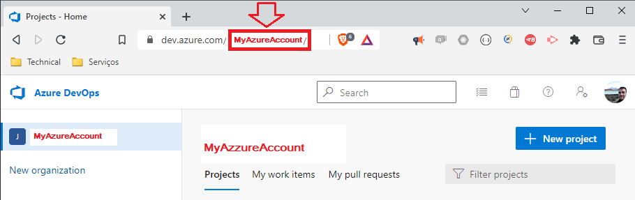
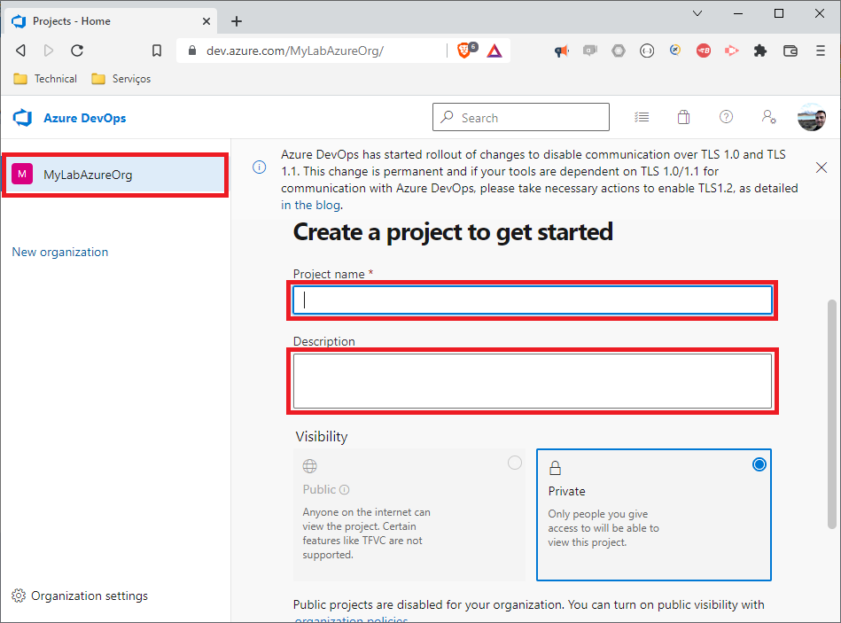

`./md/README_Cenario_Pipeline-AzureDevOps-SelfHostedAgent.md` - Pipeline Azure DevOps SelfHostedAgent

## 1. Introdução

Este repositório contém os artefatos do projeto / laboratório **LAB-XX: Pipeline Azure DevOps on a Self Hosted Agent** abaixo do projeto [devp´s=çabs](../README.md). Este laboratório consiste em:
* Configurar o DevOps Azure para o Pipeline
* Explorar os recursos e funcionalidades básicas do produto

##### Table of Contents  
- [1. Introdução](#1-introdução)
- [2. Documentação](#2-documentação)
- [3. Projeto / Laboratório](#3-projeto--laboratório)
  * [3.1. Pré-Requisitos, Pré-Condições e Premissas](#31-pré-requisitos-pré-condições-e-premissas)
    + [3.1.1. Tecnologias e ferramentas](#311-tecnologias-e-ferramentas)
    + [3.1.2. Ferramental de apoio](#312-ferramental-de-apoio)
  * [3.5. Guia de Estudo](#35-guia-de-estudo)
- [I - Referências](#i---referências)


## 2. Documentação

* n/a


## 3. Projeto / Laboratório

### 3.1. Pré-Requisitos, Pré-Condições e Premissas

#### 3.1.1. Tecnologias e ferramentas

* Azure DevOps Account, Azure DevOps Organization, Azure DevOps Project
  * https://github.com/josemarsilva/devops-labs/blob/master/md/README_Cenario_Pipeline-AzureDevOps-HelloWorld.md
* Azure DevOps: Pipeline

#### 3.1.2. Ferramental de apoio

* Ferramenta: [Draw.IO](https://app.diagrams.net/) (only for diagrams design and documentation)
* Ferramenta: [FreeMind for Windows](https://freemind.br.uptodown.com/windows)


### 3.5. Guia de Estudo

### 3.5.1. Documentação oficial e tutoriais de referência

* https://www.youtube.com/watch?v=xuKXO811O_w
* https://www.youtube.com/watch?v=8Vkxbx-zM5w

### 3.5.2. Pré-Requisitos

* Conta `<MyAzureAccount>` no serviço da [Azure DevOps](https://dev.azure.com/)



* Organization `MyLabAzureOrg` no serviço da [Azure DevOps](https://dev.azure.com/)



* Project `MyLabAzurePrj-01` no serviço da [Azure DevOps](https://dev.azure.com/)


### 3.5.3. Criar um novo `Agent Pool` no Azure DevOps Self Hosted on your local machine

* Em `https://dev.azure.com/MyLabAzureOrg/MyLabAzurePrj-01/` clique no link da `Project settings` (ícone de engrenagem) e última opção no menu lateral esquerdo em seguida no clique no botão `Agent pools` abaixo de `Pipelines` em seguida no botão `Add pool`


* Em formulário `Add agent pool` preencha os campos:
  * Pool type: `Self-hosted`
  * Name: `MySelfHostedAgent`
  * Description: `MySelfHostedAgent`
  * Pipeline Permission: `[x] Grant access permission to all pipelines`
  * Click `Create` button

* Em `https://dev.azure.com/MyLabAzureOrg/MyLabAzurePrj-01/_settings/agentqueues` click sobre o link `MySelfHostedAgent` e em seguida clique na aba `Agent` e no botão `New agent`


* Em formulário `Get the agent`:
  * Escolha uma das opções de obtenção do agent. Ex: Windows
  * Faça o Download do agente clicando no botão `Download`
  * Coloque o arquivo baixado com o agent em um diretório (Ex: C:\appe execute os comandos de extração do agent

```powershell
PS C:\> cd \Apps; mkdir agent ; cd agent
PS C:Apps\agent> Add-Type -AssemblyName System.IO.Compression.FileSystem ; [System.IO.Compression.ZipFile]::ExtractToDirectory("$HOME\Downloads\vsts-agent-win-x64-2.211.0.zip", "$PWD")
```

* Crie o Token para o próximo passo:
  * No menu superior do lado direito clique no ícone de `User Settings >> Personal Access Tokens`
  * Clique no botão `New Token`
  * No formulário `Create a New personal Access Token` informe os campos:
    * Name: `MyPersonAccessToken`
	* Expiration UTC: `31/12/2022`
	* Click link `Show all scopes`
	  * Agent Pools: `read & manage`
	  * Deployment Group: `read & manage`
	  * Click `Create` button at the botton form


* Obtenha o Token para o próximo passo:
  * No formulário `Success` clique no botão para copiar o token

* Execute a configuração de seu self Hosted Agent através do  `.\config.cmd` informe os seguintes parametros:

```powershell
PS C:\Apps\agent>  .\config.cmd

  ___                      ______ _            _ _
 / _ \                     | ___ (_)          | (_)
/ /_\ \_____   _ _ __ ___  | |_/ /_ _ __   ___| |_ _ __   ___  ___
|  _  |_  / | | | '__/ _ \ |  __/| | '_ \ / _ \ | | '_ \ / _ \/ __|
| | | |/ /| |_| | | |  __/ | |   | | |_) |  __/ | | | | |  __/\__ \
\_| |_/___|\__,_|_|  \___| \_|   |_| .__/ \___|_|_|_| |_|\___||___/
                                   | |
        agent v2.211.0             |_|          (commit 5f9e5b4)


>> Connect:

Enter server URL > https://dev.azure.com/MyLabAzureOrg
Enter authentication type (press enter for PAT) >
Enter personal access token > ****************************************************
Connecting to server ...

>> Register Agent:

Enter agent pool (press enter for default) > MySelfHostedAgent
Enter agent name (press enter for LP1764) > MySelfHostedAgent
Scanning for tool capabilities.
Connecting to the server.
Successfully added the agent
Testing agent connection.
Enter work folder (press enter for _work) >
2022-10-10 17:55:39Z: Settings Saved.
Enter run agent as service? (Y/N) (press enter for N) > N
Enter configure autologon and run agent on startup? (Y/N) (press enter for N) >
PS C:\Apps\agent>
```
  
* Optionally run the agent interactively

```powershell
PS C:\agent> .\run.cmd
```

### 3.5.4. Criar um novo repositorio para o `pipeline-SelfHostedAgent` no Azure DevOps

* Em `https://dev.azure.com/MyLabAzureOrg/MyLabAzurePrj-01/_settings/repositories` clique `Create repository`
* Em formulário `Create a repository` preencha os campos:
    * Repository Type: `Git`
	* Repository Name: `self-hosted-agent`
	* Browse repository and add new pipeline file `pipeline-self-hosted-agent.yml` com o conteúdo yaml abaixo:

```yaml
trigger: none # Disable CI triggers.
pool: MySelfHostedAgent

steps:
- script: echo Hello, world!
  displayName: 'Run a one-line script'

- script: |
    echo Add other tasks to build, test, and deploy your project.
    echo See https://aka.ms/yaml
  displayName: 'Run a multi-line script'
```


### 3.5.5. Criar um novo pipeline `pipeline-SelfHostedAgent` no Azure DevOps que deverá executar no Self Hosted configurado

* Em `https://dev.azure.com/MyLabAzureOrg/MyLabAzurePrj-01/_build` clique `New pipeline`
  * Where is your code: `Azure Repos Git`
  * Select a repository: `self-hosted-agent`
    * Configure your pipeline: `Existing Azure Pipelines YAML file`
	* Branch: `main`
	* Path: `/pipeline-self-hosted-agent.yml`
* Clique `Save`
* Clique `Run`
* Observe a execução na console da máquina SelfHostedAgent

```powershell
PS C:\Apps\agent> .\run.cmd
Scanning for tool capabilities.
Connecting to the server.
2022-10-10 18:22:10Z: Job Job completed with result: Succeeded
2022-10-10 18:33:52Z: Running job: Job
2022-10-10 18:34:02Z: Job Job completed with result: Succeeded
```


## I - Referências

* Github README.md writing sintax
  * [Basic Github Markdown Writing Format](https://docs.github.com/pt/free-pro-team@latest/github/writing-on-github/basic-writing-and-formatting-syntax)  
  * [Github Markdown Chead Sheet](https://guides.github.com/pdfs/markdown-cheatsheet-online.pdf)
  * [Github Mastering Markdown](https://guides.github.com/features/mastering-markdown/#what)
  * [Table of contents generated with markdown-toc](http://ecotrust-canada.github.io/markdown-toc/)

